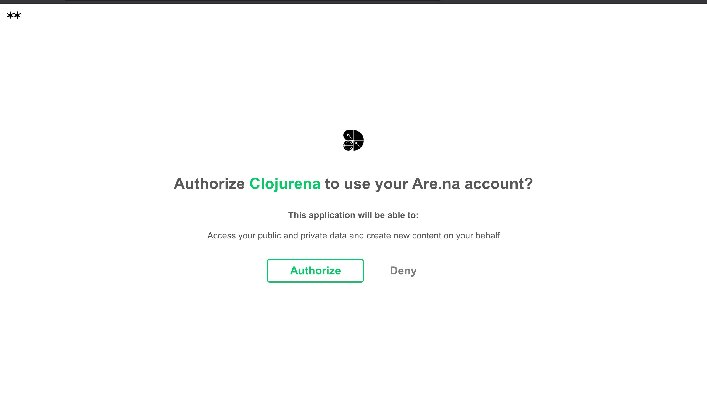

# arena-cljs

Clojurena is a small library, that acts as a wrapper for the are.na api. 

Are.na is a networked thought and visual organization tool designed to help you think and create.

# Work In Progress!

Documentation (currently very incomplete):

https://clojurena.gitbook.io/clojurena/

## Usage

In order to use this library to interact with your personal are.na account, you will need to authorize Clojurena to access your account, which can be done with the string below:

https://dev.are.na/oauth/authorize?client_id=aa7365a1f8df2aec7b31405a7fa50944df77b2bd63c5bac07f97829168867da5&redirect_uri=urn:ietf:wg:oauth:2.0:oob&response_type=code

In order to obtain an access token, you will need to login to dev.are.na, with your are.na account information, and create a new application, fill out the required information, save it, and then, under "Your Applications", select the application you just created, and you will find some keys listed, your Application Id, Secret, personal Access code, etc, these can be used in environment variables to access are.na on your behalf, or to allow your code to interact with other individuals are.na account on their behalf.

## License

Copyright © 2020 FIXME

This program and the accompanying materials are made available under the
terms of the Eclipse Public License 2.0 which is available at
http://www.eclipse.org/legal/epl-2.0.

This Source Code may also be made available under the following Secondary
Licenses when the conditions for such availability set forth in the Eclipse
Public License, v. 2.0 are satisfied: GNU General Public License as published by
the Free Software Foundation, either version 2 of the License, or (at your
option) any later version, with the GNU Classpath Exception which is available
at https://www.gnu.org/software/classpath/license.html.
